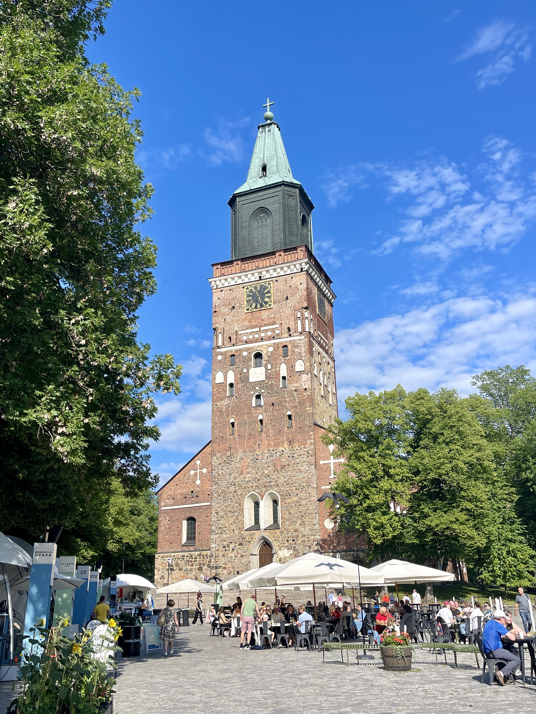
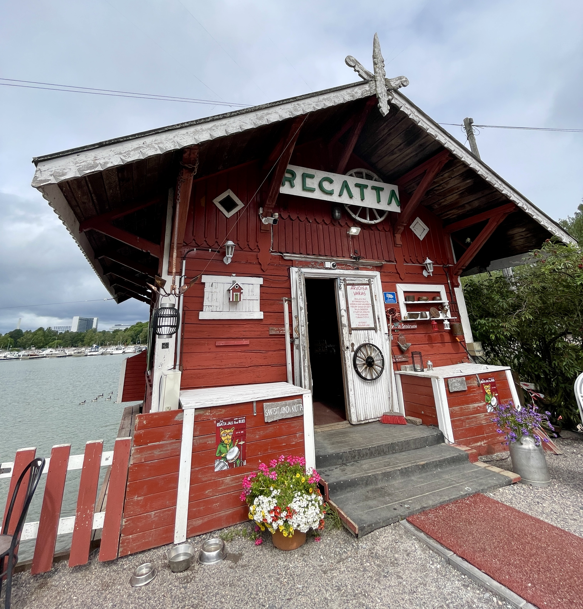
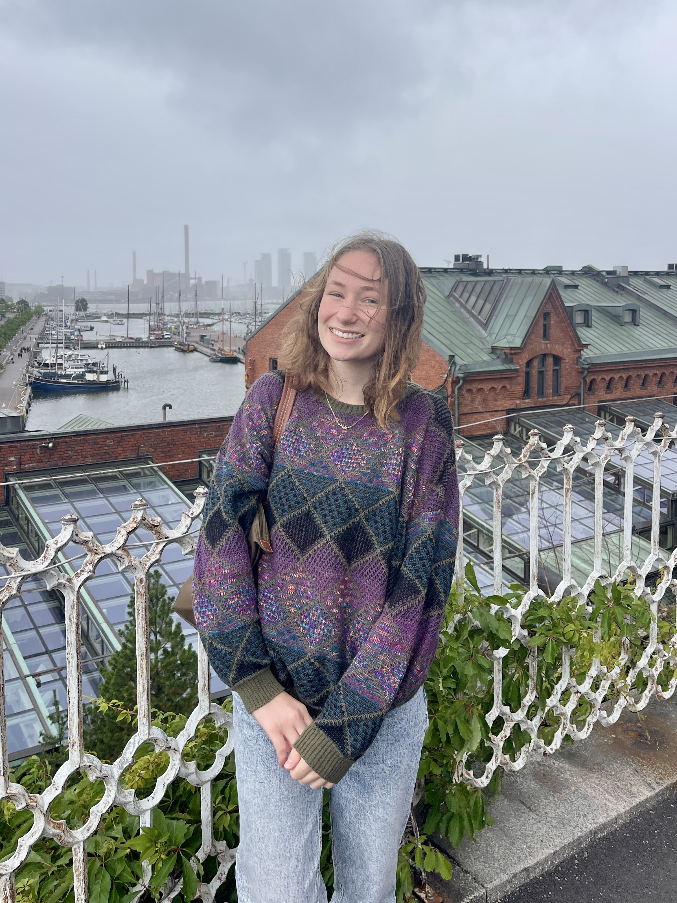
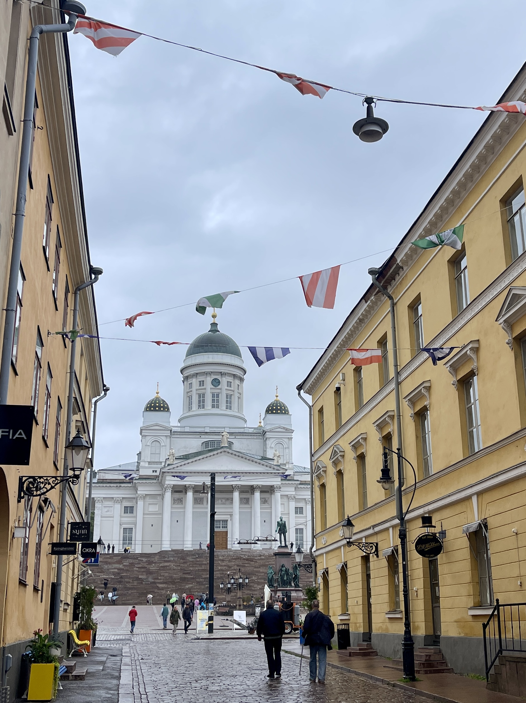
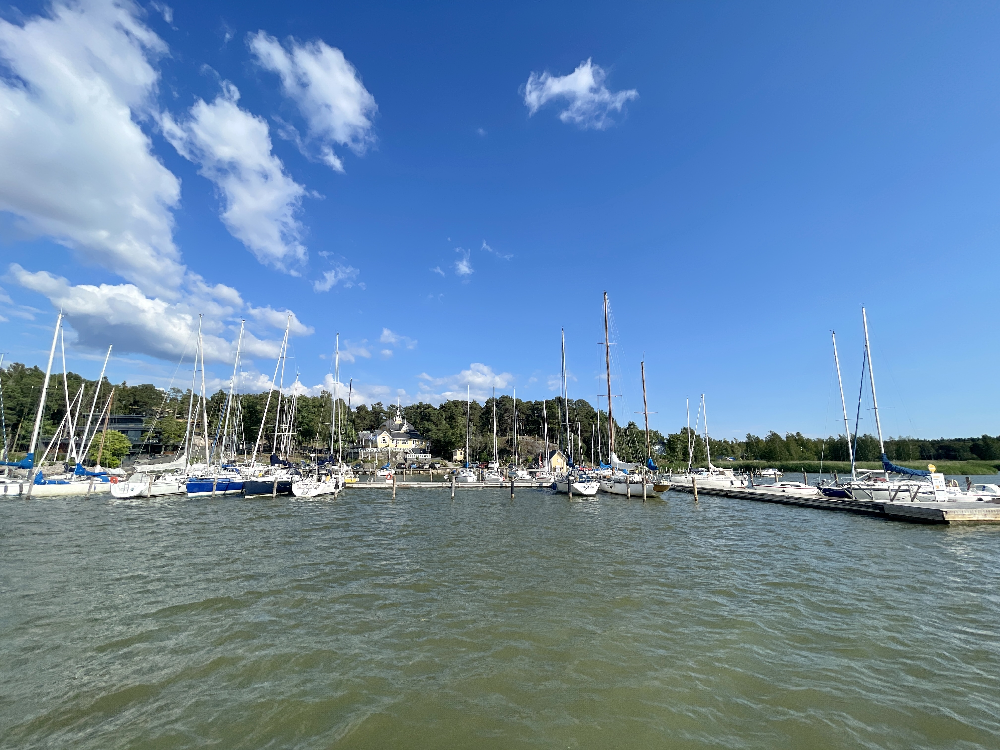
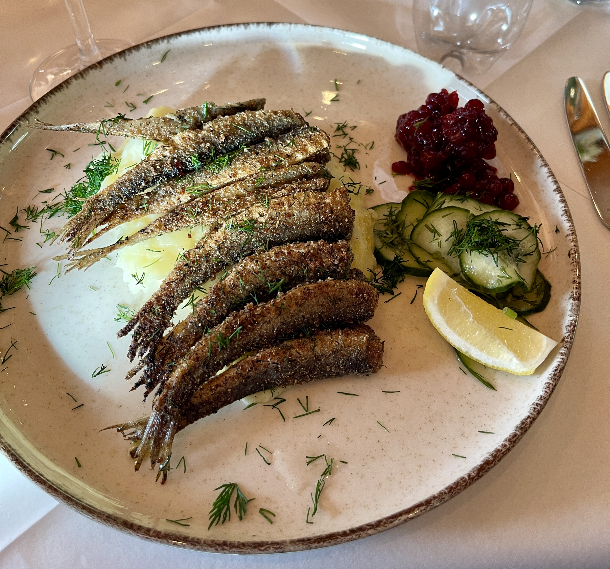

======

I had an amazing time exploring Turku and Helsinki, Finland, during the ITiCSE 2023 conference, where I presented my first publication! Here are some photos of the sights I saw and the food I enjoyed. Featured (in order) are the Turku Cathedral, Café Regatta in Helsinki, views from atop the Uspenski Cathedral, the Helsinki Cathedral, a sardine dinner, and scenic views from the waterbus in Turku.

 
 
 
 
 
 

